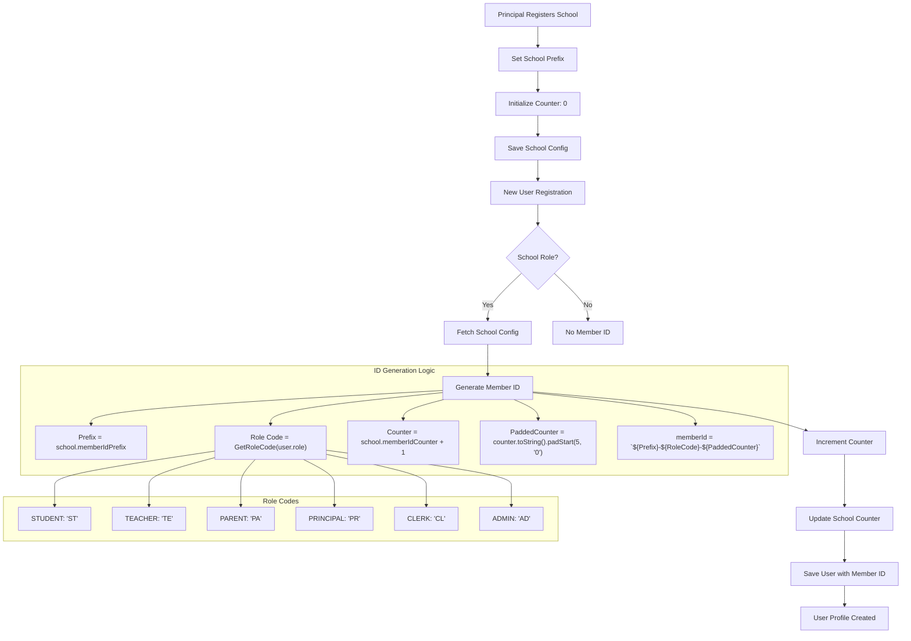

```mermaid
graph TD
    A[Principal Registers School] --> B[Set School Prefix]
    B --> C[Initialize Counter: 0]
    C --> D[Save School Config]
    
    D --> E[New User Registration]
    E --> F{School Role?}
    F -->|Yes| G[Fetch School Config]
    F -->|No| H[No Member ID]
    
    G --> I[Generate Member ID]
    I --> J[Increment Counter]
    J --> K[Update School Counter]
    K --> L[Save User with Member ID]
    
    L --> M[User Profile Created]
    
    subgraph ID Generation Logic
        I --> P1["Prefix = school.memberIdPrefix"]
        I --> P2["Role Code = GetRoleCode(user.role)"]
        I --> P3["Counter = school.memberIdCounter + 1"]
        I --> P4["PaddedCounter = counter.toString().padStart(5, '0')"]
        I --> P5["memberId = `${Prefix}-${RoleCode}-${PaddedCounter}`"]
    end
    
    subgraph Role Codes
        P2 --> R1["STUDENT: 'ST'"]
        P2 --> R2["TEACHER: 'TE'"]
        P2 --> R3["PARENT: 'PA'"]
        P2 --> R4["PRINCIPAL: 'PR'"]
        P2 --> R5["CLERK: 'CL'"]
        P2 --> R6["ADMIN: 'AD'"]
    end
```